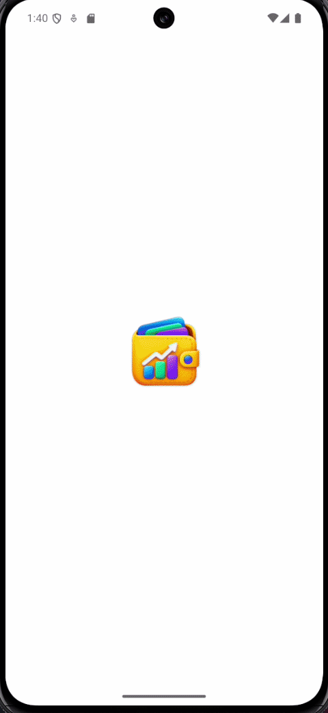
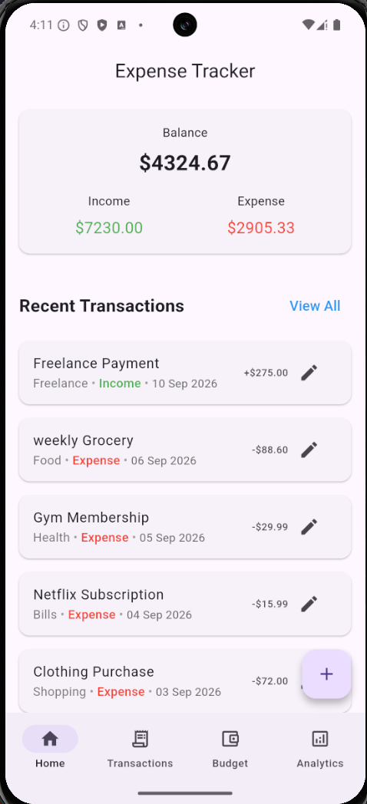
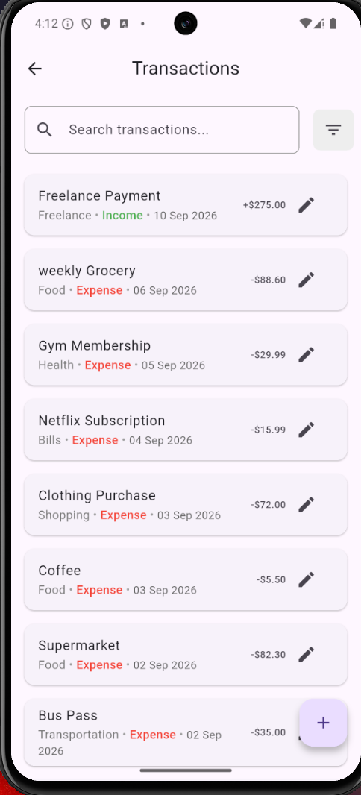
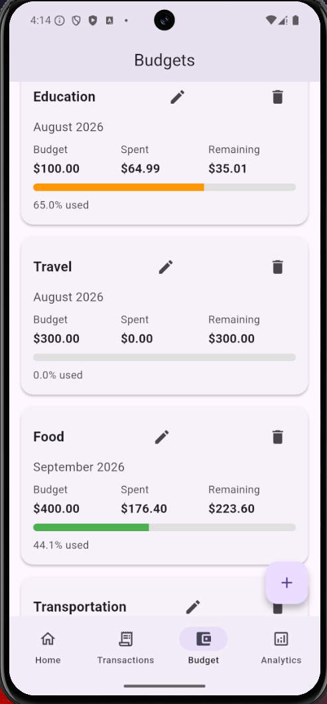
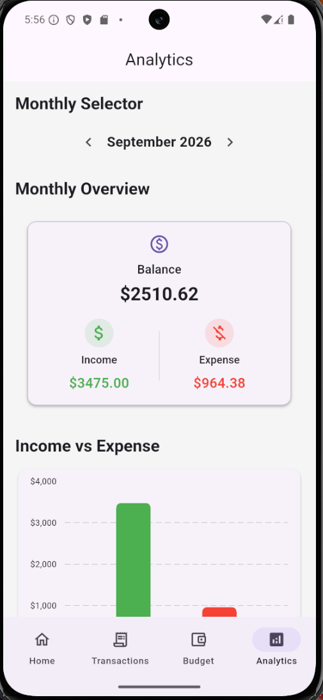
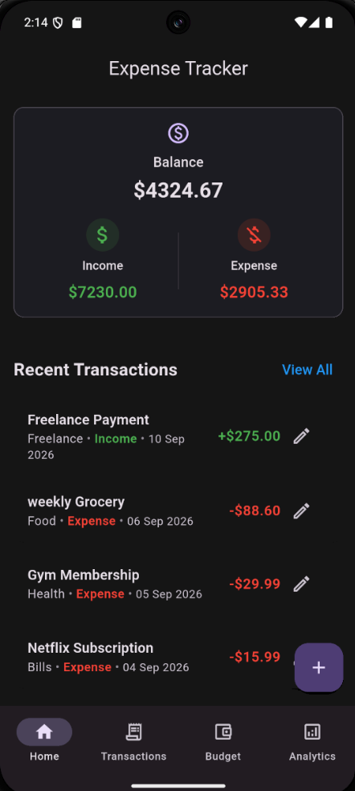

# Expense Tracker App

A cross-platform expense tracking application built with Flutter that helps users manage their income and expenses, organize transactions, and gain insights into their spending habits.

## Features

### Home Dashboard
- Overview of current balance, income, and expenses
- Display of recent transactions
- Real-time financial updates
- Quick access to the main application sections

### Transaction Management
- Add new income and expense transactions
- Edit existing transactions
- Delete transactions with a simple swipe
- Support for transaction dates and categories
- Real-time balance updates

### Transactions 
- Dedicated transactions screen
- View transaction history
- Search transactions by title or category
- Filter by transaction type
- Filter by category
- Filter by date range
- Combine multiple filters

### Categories & Organization
- Categorize transactions
- Support for income and expense categories
- Transaction date selection

### 💰 Budget Tracking
- Create budgets for expense categories
- Set spending limits
- Track spending against category budgets
- View spent and remaining amounts
- Visual budget progress indicators
- Identify exceeded budgets
- Budget progress updates automatically when transactions are added, edited, or deleted

### Spending Analytics 
- Visualize spending through charts
- Analyze spending by category
- Track incomes and expenses
- Gain insights into spending patterns

### UI & Theming 
- Light and dark mode support
- Consistent UI across application screens
- Updated application icon
- Responsive navigation between application sections

### Data Storage
- Local SQLite database
- Persistent offline storage


## Tech Stack
- **Flutter**
- **Dart**
- **SQLite (sqflite)**
- **Provider** (State Management)
- **Intl** (Date Formatting)

## App Demo 
A complete walkthrough of the application, demonstrating transaction management, search and filtering, budget tracking, spending analytics, navigation, and dark mode.


## Screenshots 

### Home Dashboard


### Transactions 


### Budget Tracking


### Spending Analytics


### Dark Mode


## Getting Started

### Prerequisites

- Flutter SDK
- Android Studio or VS Code
- Android Emulator or Physical Device

### Installation

Clone the repository:

```bash
git clone https://github.com/Zeneb-Tekarri/expense-tracker-app-flutter.git
cd expense-tracker-app-flutter
```

Install dependencies:

```bash
flutter pub get
```

Run the application:

```bash
flutter run
```

## 📌 Current Version

**v1.1.0 — Budget Tracking**

### What's included

- Transaction CRUD operations
- Income and expense tracking
- Transaction categories and dates
- Search and advanced filtering
- Dedicated Transactions screen
- Home dashboard and recent transactions
- Category-based budget tracking
- Spending analytics and charts
- Application navigation
- Light and dark mode
- Updated application icon
- SQLite local persistence
- Provider state management

## 🗺️ Future Improvements

- Export transaction data
- Notifications and budget alerts
- Additional analytics and reporting
